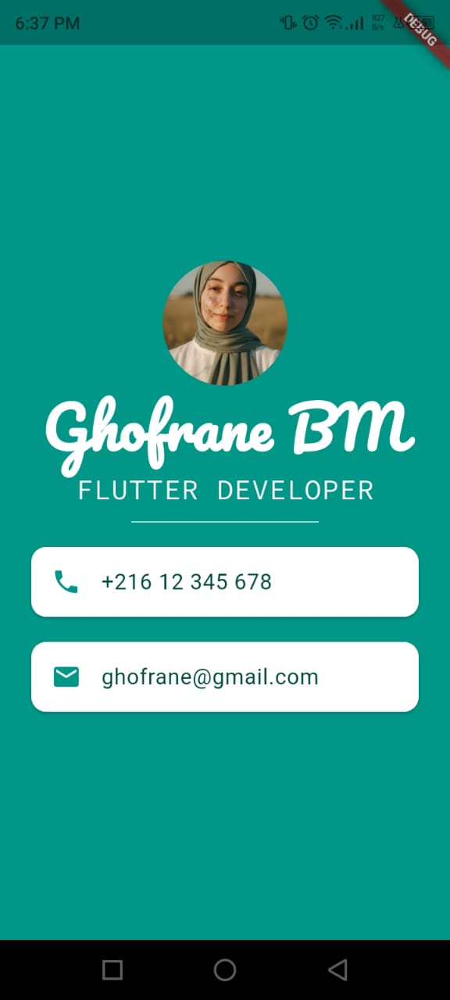

# 👤 Personal Profile Card – Flutter App

A simple Flutter application that displays a **personal profile card**, similar to a digital business card.  
The app showcases basic Flutter UI widgets, custom fonts, images, and layout techniques.

This project is part of my Flutter learning journey.

---

## 📱 App Preview


<p align="center">
  
</p>

---

## 🚀 Features

- 👤 Profile image using `CircleAvatar`
- 📝 Custom fonts
- 📇 Contact information displayed using `Card` & `ListTile`
- 🎨 Clean and minimal UI
- 📱 Responsive layout using `Column` and `SafeArea`

---

## 🛠️ Built With

- **Flutter**
- **Dart**
- **Material Design**

---

## 📂 Project Structure

```

lib/
└── main.dart
images/
└── me.png
fonts/
├── Pacifico-Regular.ttf
└── SourceCodePro-Regular.ttf
screenshots/
└── profile_card.png

````

---

## ⚙️ Installation & Run

1. **Clone the repository**
```bash
git clone https://github.com/GhBMpr/Mi_Card.git
````

2. **Navigate to the project**

```bash
cd Mi_Card
```

3. **Install dependencies**

```bash
flutter pub get
```

4. **Run the app**

```bash
flutter run
```

---

## 🖼️ Assets & Fonts Configuration

Make sure your `pubspec.yaml` includes:

```yaml
flutter:
  assets:
    - images/

  fonts:
    - family: Pacifico
      fonts:
        - asset: fonts/Pacifico-Regular.ttf
    - family: SourceCodePro
      fonts:
        - asset: fonts/SourceCodePro-Regular.ttf
```

---

## 📚 What I Learned

* Using `StatelessWidget`
* Working with `Column` and alignment
* Using `CircleAvatar` for profile images
* Custom fonts in Flutter
* Using `Card`, `ListTile`, and icons
* Basic UI styling and layout spacing

---

## 🔮 Possible Improvements

* Add social media links
* Make contact info clickable
* Add dark mode
* Add animations
* Convert to a reusable profile widget

---

## 👤 Author

**Ghofrane BM**
Flutter Developer
📍 Tunisia 🇹🇳

---

## ⭐ Support

If you like this project, feel free to **star ⭐ the repository**
and follow my Flutter learning journey!
